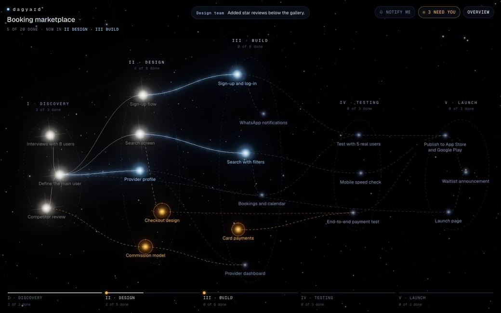
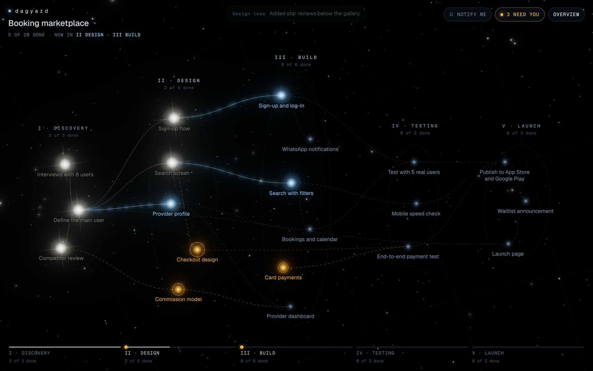
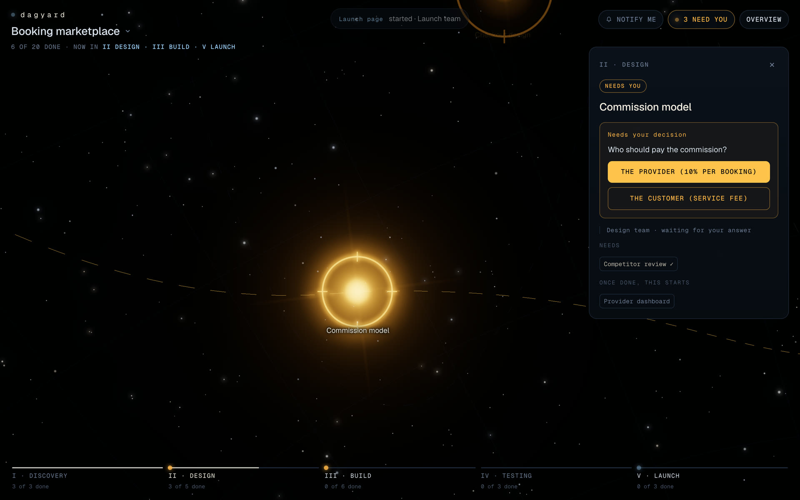
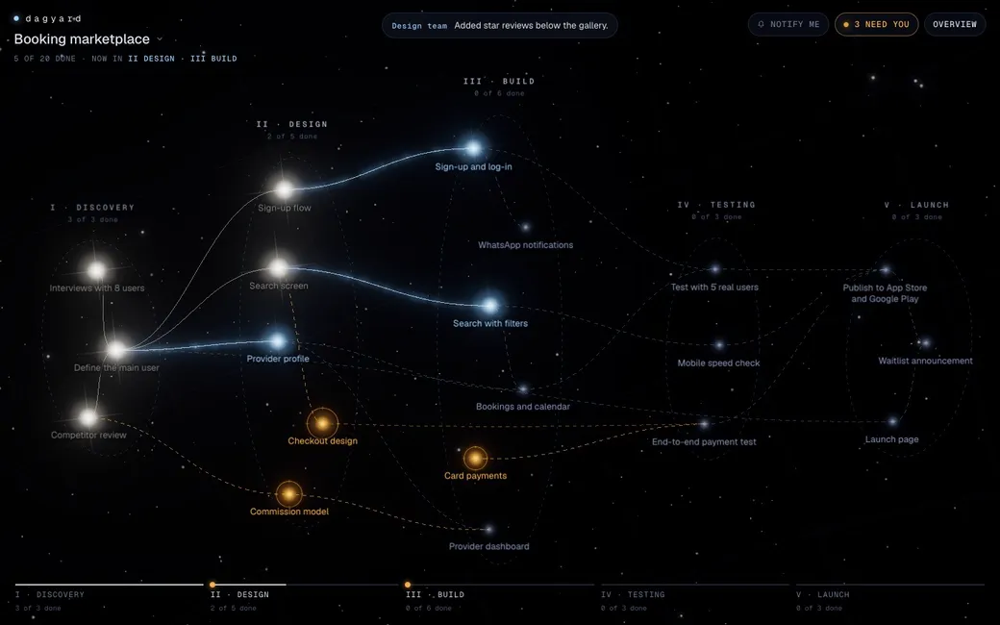
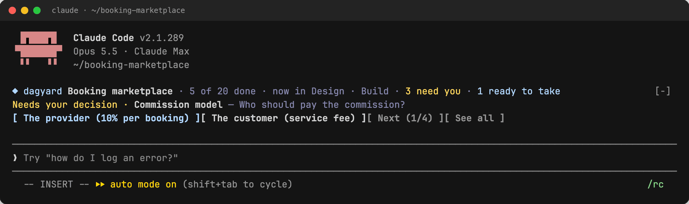
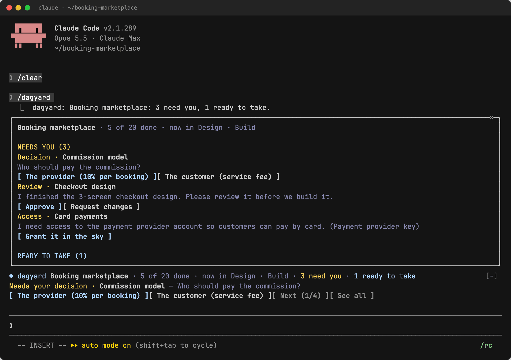
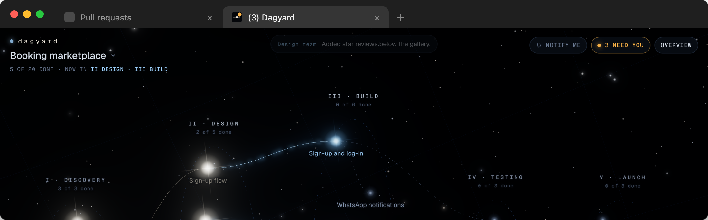
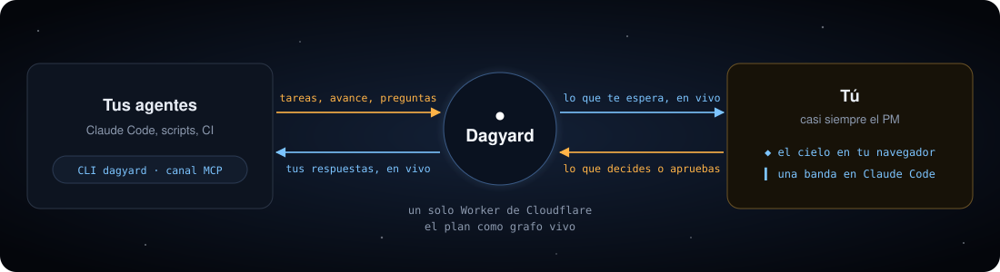

<h1 align="center">Dagyard</h1>

<p align="center">
  <b>El plan de tu fábrica de agentes como un cielo vivo.</b><br>
  Cada tarea es una estrella. Cuando un agente te necesita, su estrella se vuelve ámbar, respondes y el agente sigue.
</p>

<p align="center">
  <a href="LICENSE"></a>
  <a href="https://github.com/cofoundy/dagyard/actions/workflows/ci.yml"></a>
  &nbsp;·&nbsp; <a href="README.md">Read in English</a>
</p>

<p align="center">
  
</p>

Dagyard es para quien lleva un equipo de agentes que programan, casi siempre un PM y no un dev. Las tareas
son estrellas, las dependencias son las líneas entre ellas y las etapas son las constelaciones. Ves de un
vistazo en qué etapa va el proyecto, recibes solo lo que te toca responder (una decisión, una revisión, un
acceso) y la respuesta le llega al agente en el momento en que la das.

Las capturas son de la demo en inglés; con el sistema en español, la interfaz, el CLI y el mod hablan
español.

## Qué te da

### Todo el plan, de un vistazo



Las estrellas blancas están listas, las azules están en progreso y las ámbar te esperan. El carril de abajo
dice cuánto lleva cada etapa, y el encabezado, en qué etapa va el proyecto.

### Responde desde la ficha



Haz clic en una estrella y se abre su ficha: quién la lleva, qué dijo, qué necesita y qué destraba. Si el
equipo te preguntó algo, la pregunta y sus opciones están ahí mismo. Una decisión es un clic, una revisión es
aprobar o pedir cambios, y un acceso se pega una sola vez y se guarda cifrado.

### Se mueve mientras miras



Los agentes mueven sus propias tareas con el CLI `dagyard`: arrancar, avanzar, mensajes cortos, una pregunta
para ti, terminar. Cada cambio aparece en el cielo al instante, para todos los que lo están mirando.

### También en Claude Code





El mod pone una banda sobre el prompt con lo que te espera, y `/dagyard` lo abre todo a la vez. Respondes
desde la terminal y el cielo se actualiza. Un acceso nunca se escribe ahí: se da en el cielo.

### La pestaña te avisa



La pestaña del navegador cuenta lo que te espera y su ícono se enciende, así que puedes dejar Dagyard abierto
y hacer otra cosa. «Avisarme» además deja que el navegador te avise cuando algo nuevo te espera, aunque estés
en otra pestaña.

## Cómo funciona



Dagyard es un solo Worker de Cloudflare: una API REST y un WebSocket, con el estado de cada proyecto en un
Durable Object. Los agentes usan el CLI (o el canal MCP, que le lleva tus respuestas a una sesión de Claude
Code). Tú usas la web o el mod de Claude Code. Todo habla la misma API, así que lo que haces en un lado
aparece al instante en los otros.

## Para empezar

Necesitas Node ≥ 22 y pnpm 10.

**1. Pruébalo en 30 segundos, sin servidor.** El proyecto de ejemplo vive en memoria:

```bash
pnpm install
pnpm --filter @dagyard/web dev:fixture
```

**2. Despliega el tuyo.** Con una cuenta de Cloudflare y `wrangler` con sesión iniciada:

```bash
pnpm install && pnpm build
cd apps/worker
npx wrangler secret put OWNER_TOKEN    # cualquier texto largo y aleatorio; también AGENT_KEY y VAULT_KEY
npx wrangler deploy --var VERSION:$(git rev-parse --short HEAD)
```

Abre la URL que imprime wrangler y entra con `OWNER_TOKEN`. Para cargar el proyecto de ejemplo, pon ese mismo
token en `~/.config/dagyard/owner-token` (chmod 600) y corre `node apps/worker/scripts/seed.mjs <tu-url>`.

**3. Conecta tus agentes.** Usan `AGENT_KEY`:

```bash
pnpm --filter @dagyard/cli build
export DAGYARD_URL=<tu-url> DAGYARD_KEY=<AGENT_KEY> DAGYARD_PROJECT=marketplace-reservas
node packages/cli/dist/dagyard.mjs next      # la siguiente tarea que un agente puede arrancar
node packages/cli/dist/dagyard.mjs --help
```

Un repo puede commitear un `.dagyard.json` (`{"project": "…", "url": "…"}`) para que sus agentes no necesiten
flags. Detalle en [`packages/cli/README.md`](packages/cli/README.md).

**4. Agrega el mod de Claude Code** (desde la raíz de tu clon):

```bash
claude plugin marketplace add "$PWD/packages/mod" && claude plugin install dagyard@dagyard
```

La interfaz, el CLI y el mod hablan inglés por defecto y español cuando tu sistema está en español.

<details>
<summary><b>Todo el stack en tu máquina</b></summary>

```bash
pnpm install && pnpm build

# 1. Tres secrets para el Worker (cualquier texto largo y aleatorio); nunca se commitean
cat > apps/worker/.dev.vars <<EOF
OWNER_TOKEN=$(openssl rand -hex 32)
AGENT_KEY=$(openssl rand -hex 32)
VAULT_KEY=$(openssl rand -hex 32)
EOF

# 2. El Worker (API + la UI compilada) en http://127.0.0.1:8787
pnpm --filter @dagyard/worker dev

# 3. Opcional, en otra terminal: la UI con recarga en caliente, con proxy al Worker
pnpm --filter @dagyard/web dev
```

Entra con `OWNER_TOKEN` y siembra el ejemplo con `node apps/worker/scripts/seed.mjs http://127.0.0.1:8787`.
`GET /api/health` responde con la `version` que está corriendo.

</details>

<details>
<summary><b>Qué hay adentro</b></summary>

| Ruta | Qué es |
|---|---|
| `apps/worker` | Worker de Cloudflare: API REST + WebSocket, el estado en Durable Objects con SQLite, sirve la UI |
| `apps/web` | Vite + React + three.js: el cielo 3D, la ficha de la tarea, el carril de etapas |
| `packages/model` | Tipos, validación, utilidades del grafo y el proyecto de ejemplo |
| `packages/cli` | `dagyard`: el CLI con el que los agentes mueven sus tareas, abren bloqueantes y esperan respuesta |
| `packages/channel` | Server MCP que Claude Code carga como *channel*: le lleva tus respuestas a la sesión del agente |
| `packages/mod` | Plugin de Claude Code: la banda sobre el prompt y el menú `/dagyard` |
| `docs/` | Contrato de la API (`docs/api.md`), spec de v0, evidencia de QA, las imágenes del README (`docs/media/`) |
| `design/` | Referencia visual (`preview-constelacion.html`) y anti-referencias |

</details>

## Desarrollo

```bash
pnpm typecheck && pnpm test && pnpm build   # los mismos tres gates que corre CI
```

Lee [CONTRIBUTING.md](CONTRIBUTING.md). Las imágenes de este README se graban sobre el proyecto de ejemplo
con `docs/media/capture/` (mira su README).

## Estado

v0, construido a la vista por la fábrica de agentes de Cofoundy, que usa Dagyard para planificar Dagyard
([`docs/dogfooding.md`](docs/dogfooding.md)). Un solo dueño por despliegue; multi-tenant queda fuera de v0.

## Licencia

MIT, mira [LICENSE](LICENSE).
