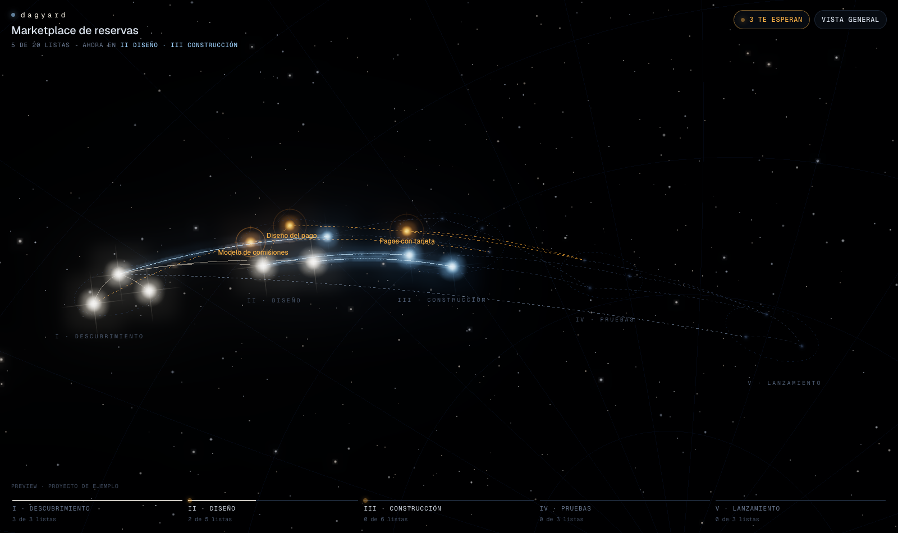

# Dagyard

**El plan de tu fábrica de agentes como un DAG vivo en 3D.** Ves en qué etapa va el proyecto, recibes solo
lo que te toca (decisiones, revisiones y accesos) y desbloqueas a tus agentes desde ahí.

[Read in English](README.md)



Dagyard es para quien lleva un equipo de agentes que programan, casi siempre un PM y no un dev. Cada tarea
es una estrella, las dependencias son las líneas entre ellas y las etapas son las constelaciones. Cuando un
agente necesita a una persona (elegir una opción, aprobar un diseño, entregar un acceso) abre un
*bloqueante* en su tarea, la estrella se vuelve ámbar y la respuesta le llega al agente en tiempo real.

## Qué hay adentro

| Ruta | Qué es |
|---|---|
| `apps/worker` | Worker de Cloudflare: API REST + WebSocket, el estado en Durable Objects con SQLite, sirve la UI |
| `apps/web` | Vite + React + three.js: el cielo 3D, la ficha de la tarea, el carril de etapas |
| `packages/model` | Tipos, validación, utilidades del grafo y el proyecto de ejemplo |
| `packages/cli` | `dagyard`: el CLI con el que los agentes mueven sus tareas, abren bloqueantes y esperan respuesta |
| `packages/channel` | Server MCP que Claude Code carga como *channel*: le lleva tus respuestas a la sesión del agente |
| `packages/mod` | Plugin de Claude Code: una banda sobre el prompt con lo que te espera y el menú `/dagyard` |
| `docs/` | Contrato de la API (`docs/api.md`), spec de v0, evidencia de QA |
| `design/` | Referencia visual (`preview-constelacion.html`) y anti-referencias |

## Pruébalo en 30 segundos (sin servidor)

Necesitas Node ≥ 22 y pnpm 10.

```bash
pnpm install
pnpm --filter @dagyard/web dev:fixture
```

Abre la URL que imprime Vite. El proyecto de ejemplo vive en memoria; desde la consola del navegador haces
de agente, por ejemplo `dagyard.message('marketplace-reservas', 'pagos-con-tarjeta', 'Ya conecté la pasarela.')`.

## Todo el stack en tu máquina

```bash
pnpm install && pnpm build

# 1. Tres secrets para el Worker (cualquier texto largo y aleatorio); nunca se commitean
cat > apps/worker/.dev.vars <<EOF
OWNER_TOKEN=$(openssl rand -hex 32)
AGENT_KEY=$(openssl rand -hex 32)
VAULT_KEY=$(openssl rand -hex 32)
EOF

# 2. El Worker (API + la UI compilada) en http://127.0.0.1:8787
pnpm --filter @dagyard/worker dev

# 3. Opcional, en otra terminal: la UI con recarga en caliente, con proxy al Worker
pnpm --filter @dagyard/web dev
```

Entra con `OWNER_TOKEN`. Para cargar el proyecto de ejemplo, pon ese mismo token en
`~/.config/dagyard/owner-token` (chmod 600) y corre `node apps/worker/scripts/seed.mjs http://127.0.0.1:8787`.

Los agentes le hablan al mismo servidor con `AGENT_KEY`:

```bash
pnpm --filter @dagyard/cli build
export DAGYARD_URL=http://127.0.0.1:8787 DAGYARD_KEY=<AGENT_KEY> DAGYARD_PROJECT=marketplace-reservas
node packages/cli/dist/dagyard.mjs next          # la siguiente tarea arrancable, como línea /goal
node packages/cli/dist/dagyard.mjs --help
```

Un repo puede commitear un `.dagyard.json` (`{"project": "…", "url": "…"}`) para que sus agentes no necesiten
flags; el CLI le manda la key a esa URL solo si es `https` y de confianza. La key sale únicamente de
`DAGYARD_KEY` o de `~/.config/dagyard/agent-key`. Detalle en `packages/cli/README.md`.

## Despliega el tuyo

Dagyard es un solo Worker. Con una cuenta de Cloudflare y `wrangler` con sesión iniciada:

```bash
pnpm build
cd apps/worker
npx wrangler secret put OWNER_TOKEN    # y AGENT_KEY, VAULT_KEY
npx wrangler deploy --var VERSION:$(git rev-parse --short HEAD)
```

`GET /api/health` responde con la `version` desplegada. Los valores de acceso (las credenciales que una
persona le entrega a un agente) se guardan cifrados con `VAULT_KEY` y nunca salen en snapshots ni eventos.

## Desarrollo

```bash
pnpm typecheck && pnpm test && pnpm build   # los mismos tres gates que corre CI
```

Lee [CONTRIBUTING.md](CONTRIBUTING.md).

## Estado

v0, construido a la vista por la fábrica de agentes de Cofoundy, que usa Dagyard para planificar Dagyard
(`docs/dogfooding.md`). Un solo dueño por despliegue; multi-tenant queda fuera de v0.

## Licencia

MIT, mira [LICENSE](LICENSE).
