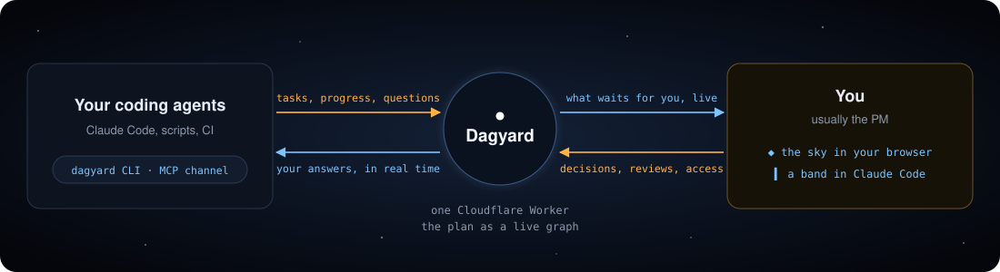

<h1 align="center">Dagyard</h1>

<p align="center">
  <b>Your agent factory's plan as a living sky.</b><br>
  Every task is a star. When an agent needs you, its star turns amber, you answer, and the agent keeps going.
</p>

<p align="center">
  <a href="LICENSE"></a>
  <a href="https://github.com/cofoundy/dagyard/actions/workflows/ci.yml"></a>
  &nbsp;·&nbsp; <a href="README.es.md">Leer en español</a>
</p>

<p align="center">
  
</p>

Dagyard is for the person who runs a team of coding agents, usually a PM and not a developer. Tasks are
stars, dependencies are the lines between them, and stages are the constellations. You see at a glance what
stage the project is in, you only get what is yours to answer (a decision, a review, an access) and the
answer reaches the agent the moment you give it.

## What you get

### The whole plan, in one look


White stars are done, blue ones are being worked on, amber ones are waiting for you. The rail at the bottom
says how far each stage is, and the header says where the project is now.

### Answer from the card


Click a star and its card opens: who is on it, what they said, what it needs and what it unlocks. When the
team asked you something, the question and its options are right there. A decision is one click, a review is
approve or ask for changes, and an access is pasted once and stored encrypted.

### It moves while you watch


Agents move their own tasks with the `dagyard` CLI: start, progress, short messages, a question for you,
done. Every change shows up in the sky right away, for everyone looking at it.

### In Claude Code, too


The mod puts a band above the prompt with what waits for you, and `/dagyard` opens everything at once. You
answer from the terminal and the sky updates. Access values are never typed here: they are given in the sky.

### The tab tells you


The browser tab counts what waits for you and its icon lights up, so you can leave Dagyard open and do
something else. «Notify me» also lets the browser alert you when something new needs you, even from another tab.

## How it works



Dagyard is a single Cloudflare Worker: a REST API and a WebSocket, with each project's state in a Durable
Object. Agents use the CLI (or the MCP channel, which pushes your answers into a Claude Code session). You use
the web app or the Claude Code mod. Everything speaks the same API, so what you do in one place appears in
the others at once.

## Quickstart

Requires Node ≥ 22 and pnpm 10.

**1. Try it in 30 seconds, no server.** The example project lives in memory:

```bash
pnpm install
pnpm --filter @dagyard/web dev:fixture
```

**2. Deploy your own.** With a Cloudflare account and `wrangler` logged in:

```bash
pnpm install && pnpm build
cd apps/worker
npx wrangler secret put OWNER_TOKEN    # any long random string; also AGENT_KEY and VAULT_KEY
npx wrangler deploy --var VERSION:$(git rev-parse --short HEAD)
```

Open the URL wrangler prints and sign in with `OWNER_TOKEN`. To load the example project, put the same token
in `~/.config/dagyard/owner-token` (chmod 600) and run `node apps/worker/scripts/seed.mjs <your-url>`.

**3. Connect your agents.** They use `AGENT_KEY`:

```bash
pnpm --filter @dagyard/cli build
export DAGYARD_URL=<your-url> DAGYARD_KEY=<AGENT_KEY> DAGYARD_PROJECT=booking-marketplace
node packages/cli/dist/dagyard.mjs next      # the next task an agent can start
node packages/cli/dist/dagyard.mjs --help
```

A repo can commit a `.dagyard.json` (`{"project": "…", "url": "…"}`) so its agents need no flags. Details in
[`packages/cli/README.md`](packages/cli/README.md).

**4. Add the Claude Code mod** (from the root of your clone):

```bash
claude plugin marketplace add "$PWD/packages/mod" && claude plugin install dagyard@dagyard
```

The interface, the CLI and the mod speak English by default and Spanish when your system is in Spanish.

<details>
<summary><b>Run the full stack locally</b></summary>

```bash
pnpm install && pnpm build

# 1. Three secrets for the Worker (any long random strings), never committed
cat > apps/worker/.dev.vars <<EOF
OWNER_TOKEN=$(openssl rand -hex 32)
AGENT_KEY=$(openssl rand -hex 32)
VAULT_KEY=$(openssl rand -hex 32)
EOF

# 2. The Worker (API + built UI) on http://127.0.0.1:8787
pnpm --filter @dagyard/worker dev

# 3. Optional, in another terminal: the UI with hot reload, proxied to the Worker
pnpm --filter @dagyard/web dev
```

Sign in with `OWNER_TOKEN` and seed the example with `node apps/worker/scripts/seed.mjs http://127.0.0.1:8787`.
`GET /api/health` answers with the running `version`.

</details>

<details>
<summary><b>What's inside</b></summary>

| Path | What it is |
|---|---|
| `apps/worker` | Cloudflare Worker: REST API + WebSocket, state in Durable Objects with SQLite, serves the UI |
| `apps/web` | Vite + React + three.js: the 3D sky, the task card, the stage rail |
| `packages/model` | Shared types, validation, graph helpers and the example project |
| `packages/cli` | `dagyard`: the CLI agents use to move their tasks, open blockers and wait for answers |
| `packages/channel` | MCP server that Claude Code loads as a *channel*: pushes your answers into the agent's session |
| `packages/mod` | Claude Code plugin: the band over the prompt and the `/dagyard` menu |
| `docs/` | API contract (`docs/api.md`), v0 spec, QA evidence, README media (`docs/media/`) |
| `design/` | Visual reference (`preview-constelacion.html`) and anti-references |

</details>

## Development

```bash
pnpm typecheck && pnpm test && pnpm build   # the same three gates CI runs
```

See [CONTRIBUTING.md](CONTRIBUTING.md). The media in this README is recorded from the example project with
`docs/media/capture/` (see its README).

## Status

v0, built in the open by Cofoundy's own agent factory, which uses Dagyard to plan Dagyard
([`docs/dogfooding.md`](docs/dogfooding.md)). One owner per deployment; multi-tenant is out of scope for v0.

## License

MIT, see [LICENSE](LICENSE).
