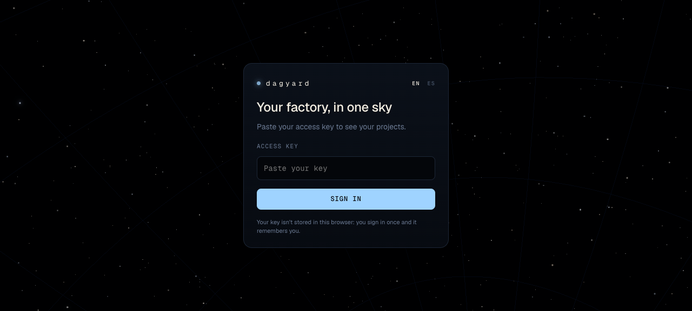
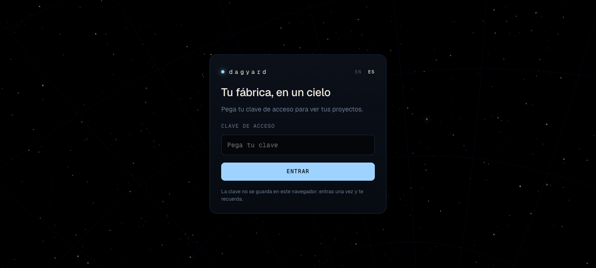
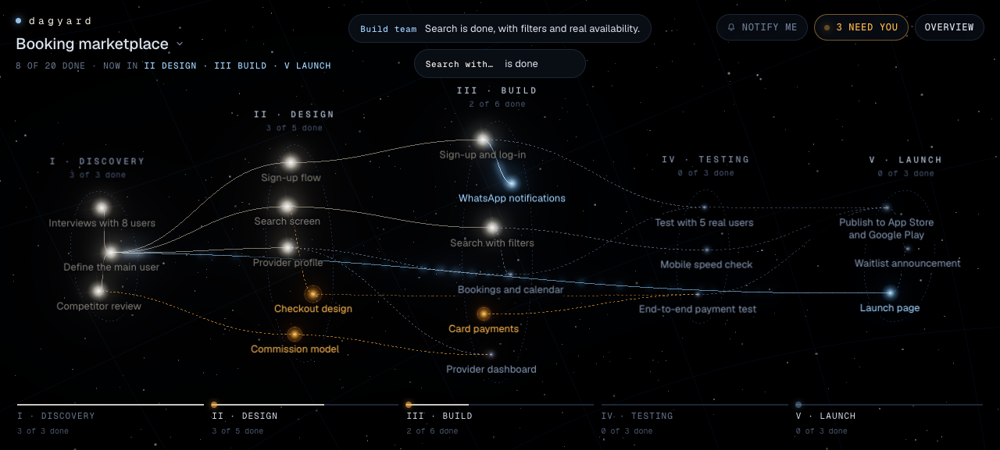
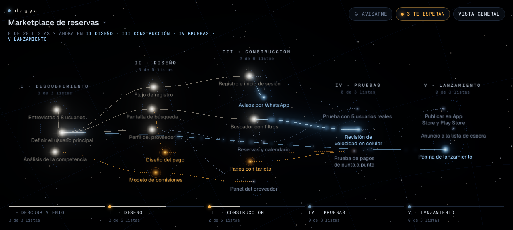
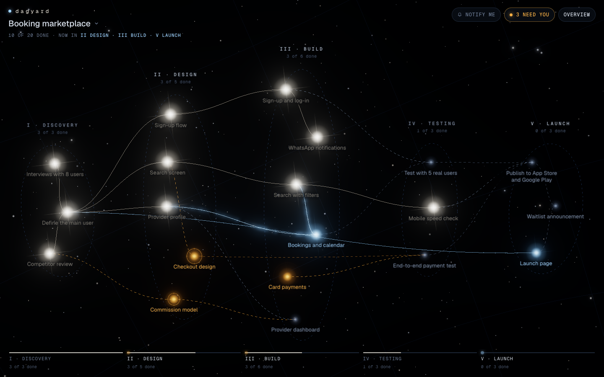
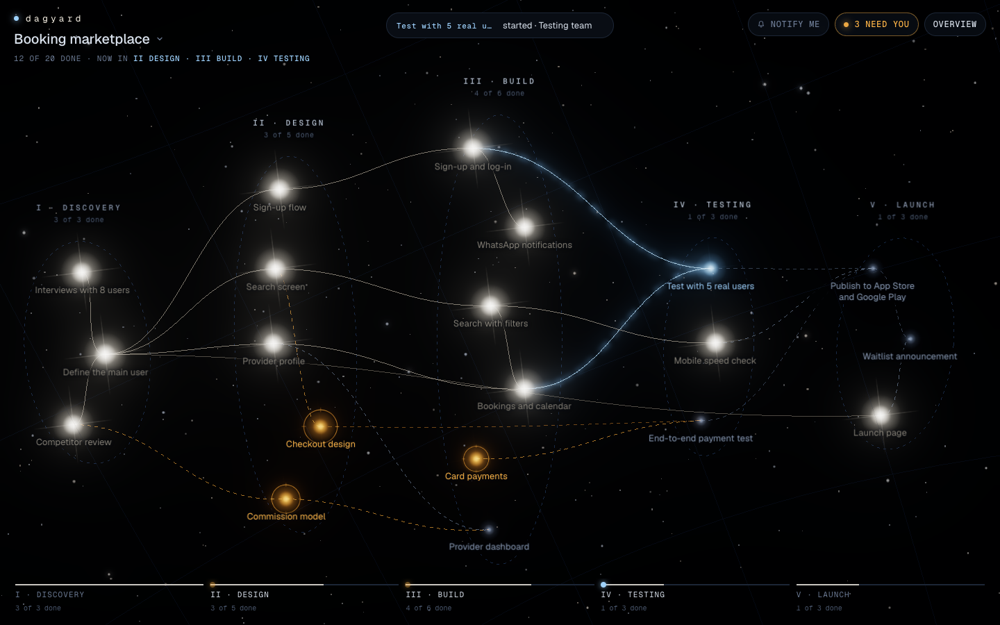

# La demo viva, en inglés y en español (#74)

**Resultado:** al entrar, Dagyard abre la demo en el idioma del navegador y la demo se mueve sola mientras
alguien la mira. Medido en la preview el 2026-10-04 con `49f5425` desplegado: **21 cambios en 60 s en
inglés y 23 en español, sin tocar nada**, y las 3 cosas que te esperan siguen abiertas en las dos.

## Lo que ve un PM

| | Inglés (`en-US`) | Español (`es-PE`) |
|---|---|---|
| Entrada |  |  |
| Al entrar, sin elegir proyecto |  «Booking marketplace» |  «Marketplace de reservas» |

## 20 segundos sin tocar nada (inglés)

| t = 0 s | t = 20 s |
|---|---|
|  |  |

En 20 s pasa de «10 of 20 done» a «12 of 20 done», «Test with 5 real users» arranca con su equipo y el
carril de etapas avanza. Los frames de 40 y 60 s no salieron: la sesión de `agent-browser` se caía con la
máquina cargada (load ≈ 29). Los 60 s completos están medidos por WebSocket, abajo.

## 60 segundos por WebSocket

`sonda-60s-en.txt` y `sonda-60s-es.txt`: cada evento que llega a un navegador conectado, con su segundo.

| Demo | Eventos en 60 s | Avances | Mensajes | Bloqueantes abiertos al final |
|---|---|---|---|---|
| booking-marketplace | 21 | 16 | 5 | 3 |
| marketplace-reservas | 23 | 17 | 6 | 3 |

## Tiempo real y proyectos reales

- Un `dagyard msg` sobre el proyecto «dagyard» llegó al WebSocket en menos de 1 s, y en 14 s ese
  proyecto no recibió ningún evento del pulso.
- `/api/health` dio `49f5425` (`origin/main` HEAD) en 6 llamadas seguidas; `/api/projects` sin credencial da 401.

## Lo que no está aquí

- La escena y el travelling no se rediseñaron: los define #75 (pedido de André, 14:05). El pase de
  diseño que se hizo antes del pivot quedó en la rama `demo/escena` como insumo.
- El aviso sin WebGL y el proyecto de ejemplo sin servidor siguen solo en español: #83.
