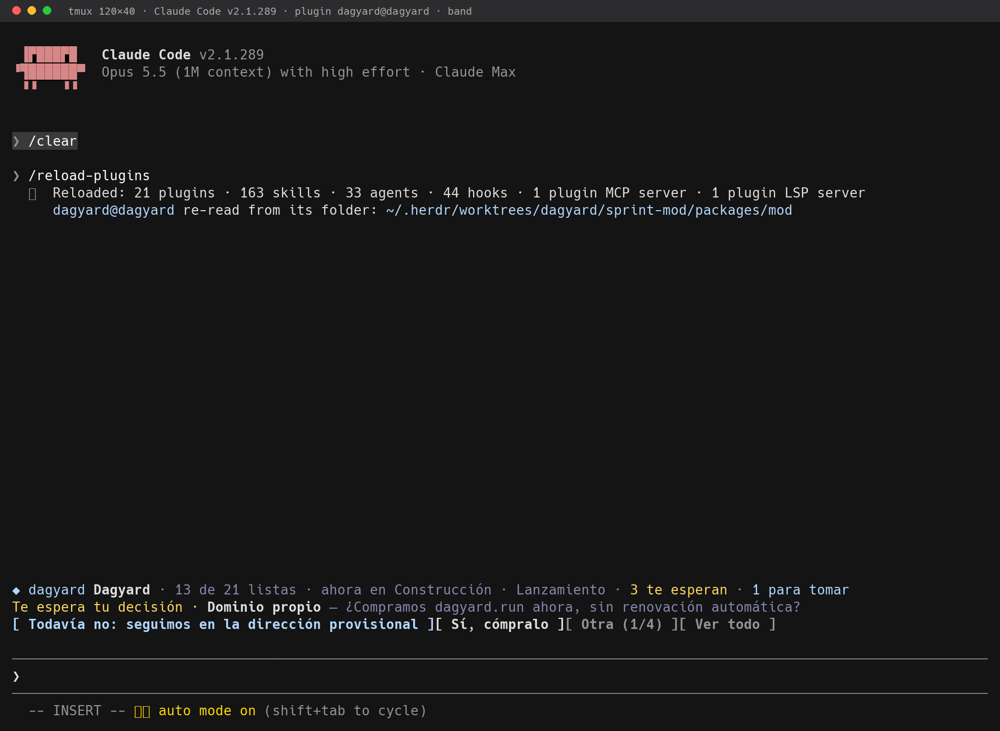
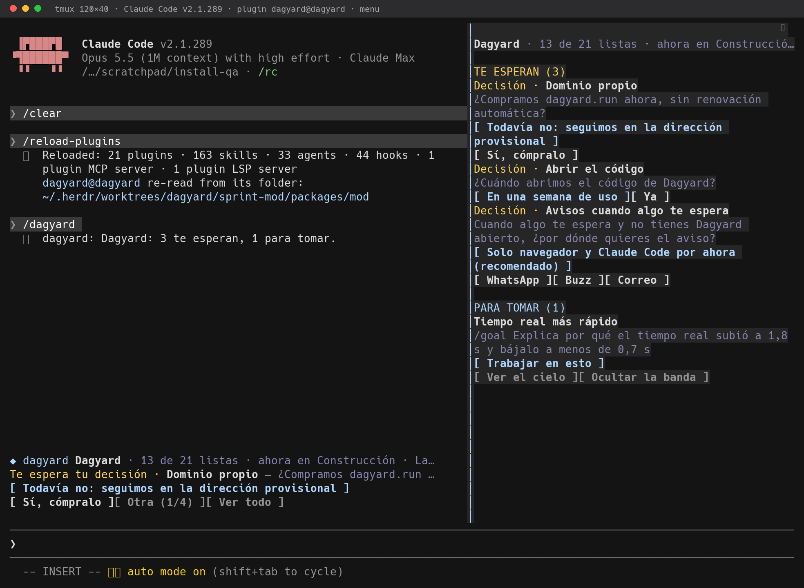
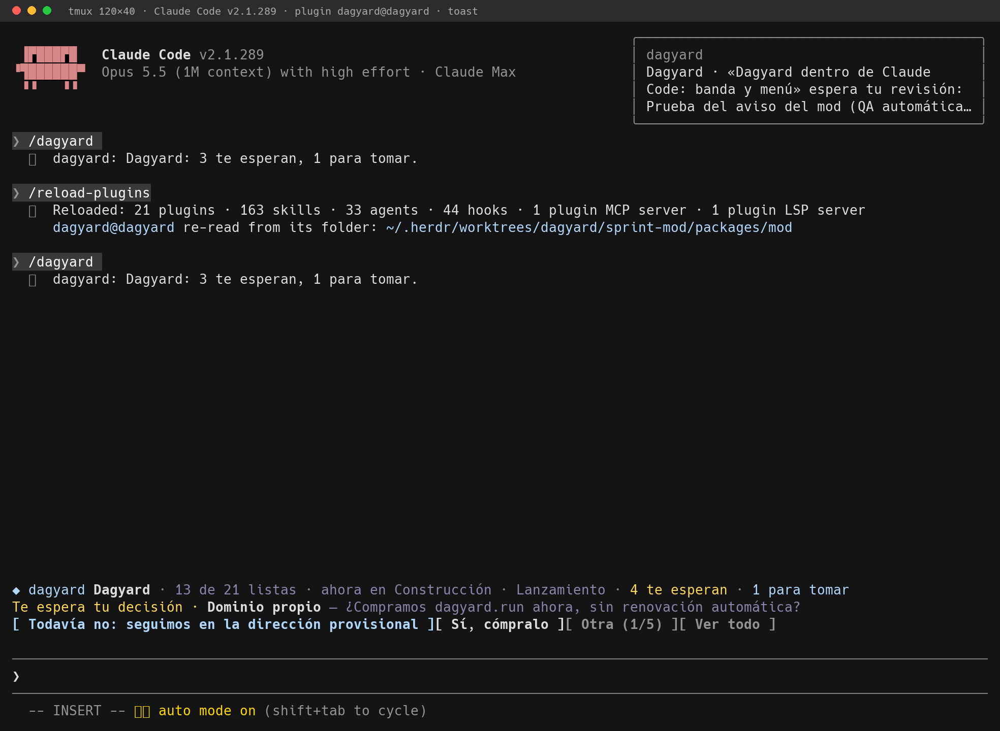

# Dagyard en Claude Code

Una banda sobre el prompt con lo que le toca a esta sesión, un menú para responderlo todo de corrido
y un aviso cuando algo nuevo te espera. Todo lo que haces aquí se ve al instante en el cielo (la web),
porque escribe en la misma API.

- **Te espera**: una decisión o una revisión se responden desde la banda o el menú. Un acceso se da
  en el cielo: su valor nunca pasa por la terminal. «Darlo en el cielo» abre esa tarea con su ficha.
- **Ver el cielo**: abre el proyecto del repo (o la tarea en la que estás trabajando).
- **Para tomar**: lo pendiente, sin equipo y con todo lo que necesita ya listo. «Trabajar en esto» la
  arranca y fija su `/goal` en la sesión.
- **Menú** (`/dagyard` o «Ver todo»): todo lo anterior a la vez.
- **Aviso**: cuando se abre algo nuevo que te espera, un toast en ≤20 s.





## Instalación (un paso)

Desde la raíz de tu clon del repo:

```bash
claude plugin marketplace add "$PWD/packages/mod" && claude plugin install dagyard@dagyard
```

Queda instalado para todas tus sesiones y se lee desde esta carpeta: un `git pull` del repo lo
actualiza (en una sesión abierta, `/reload-plugins`). Para probarlo sin instalar:
`claude --plugin-dir "$PWD/packages/mod"`.

Quitarlo: `claude plugin uninstall dagyard@dagyard && claude plugin marketplace remove dagyard`.

## A qué proyecto mira

El primero que encuentre, en este orden:

1. `DAGYARD_PROJECT` (y `DAGYARD_URL`) en el entorno;
2. el `.dagyard.json` más cercano subiendo desde la carpeta de la sesión, p. ej.
   `{"project": "dagyard", "url": "https://dagyard.cofoundy-dev.workers.dev"}` (`url` es opcional);
3. `~/.config/dagyard/project` (y `url`).

Sin proyecto, el mod calla: ni banda ni llamadas; `/dagyard` dice cómo enlazar el repo. Así puede
quedar instalado en todas las sesiones sin ensuciar los repos que no usan Dagyard. El servidor, si
nada lo dice, es `https://dagyard.cofoundy-dev.workers.dev`.

Las claves salen de `~/.config/dagyard/agent-key` (leer y tomar tareas) y `owner-token` (responder lo
que te espera). Nunca se imprimen.

## Desarrollo

```bash
claude plugin validate packages/mod   # manifiesto y módulo, como los lee el motor
claude plugin test packages/mod       # hooks/*.test.ts(x)
```

`hooks/view.ts` calcula la vista desde el snapshot (puro); `hooks/register.tsx` es todo lo que toca
el motor: la banda (`AbovePrompt`), el menú (`Pane` `dagyard-menu`), el comando y el sondeo cada
10 s. Los tipos del motor los escribe Claude Code en `.claude-plugin/types/` al cargar el mod
(ignorados por git); con ellos, `npx tsc -p packages/mod` revisa los tipos.
